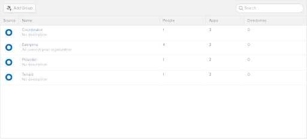

# Setting Everything Up
## AppSettings
Because appsettings.json is not gitignored, you will have to copy the contents of it to appsettings.development.json, which is gitignored, before making any changes. \
Identity: \
{ \
  "ConnectionStrings": { \
    "ServiceBus": "Endpoint=sb://revhousing.servicebus.windows.net/;SharedAccessKeyName=RootManageSharedAccessKey;SharedAccessKey=C9iatG+Im1Glp1QjMFrULMWsQVE+9uea0ZKaEQTZ7S4=", \
    "IdentityDb": "Server=192.168.99.100;Port=8000;Database=IdentityDb;Username=postgres;Password=Pass@word" \
  }, \
  "Okta": { \
    "OktaDomain": "https://dev-808810.okta.com", \
    "ClientId": "0oa2tzs0sNkOVRCKy4x6", \
    "Token": "000jeGaXFDDLBZVjKyNZ_B58uPPwTb3YS8zQ9kFIYl" \
  } \
} \
Lodging: \
Tenant: \
Address: 

## Docker
We use docker to spin up development databases with the following command: \
*docker run --rm -it -e POSTGRES_PASSWORD=Pass@word -p 8000:5432 postgres:alpine* \
This will spin up a docker container with the postgres image that can be accessed on port 8000 with password Pass@word. If you are using Docker Desktop, this will be localhost:8000. If you are using Docker Toolbox, this will be at 192.168.99.100:8000. In order to access it from Visual Studio, you will need to set up the connection string in your secrets.json file. The following is an example for the Tenant service with Docker Desktop, on port 8000, with password Pass@word. You will have to change localhost to 192.168.99.100 if you are using docker toolbox. \
{ \
  "ConnectionStrings": { \
    "TenantDb": "Server=localhost;Port=8000;Database=tenant;Username=postgres;Password=Pass@word" \
  }, \
  "Okta": {  \
      "OktaDomain": “Okta-Domain-Here” \
    } \
  } \
  As of right now, your programs will not run because your Okta domain “does not start with https”
The following section will fix that. 
# Okta
As of right now, this is needed for all services besides the Address service.
To get okta working from the codebase, an okta account is needed. 
Go to https://developer.okta.com/, click on signup, and fill out the required information.
After confirming your email, go to your new account and click on Users->Groups and click add group, creating “Coordinator”. Create the groups “Provider” and “Tenant” as well.
Your groups should look something like this: 

