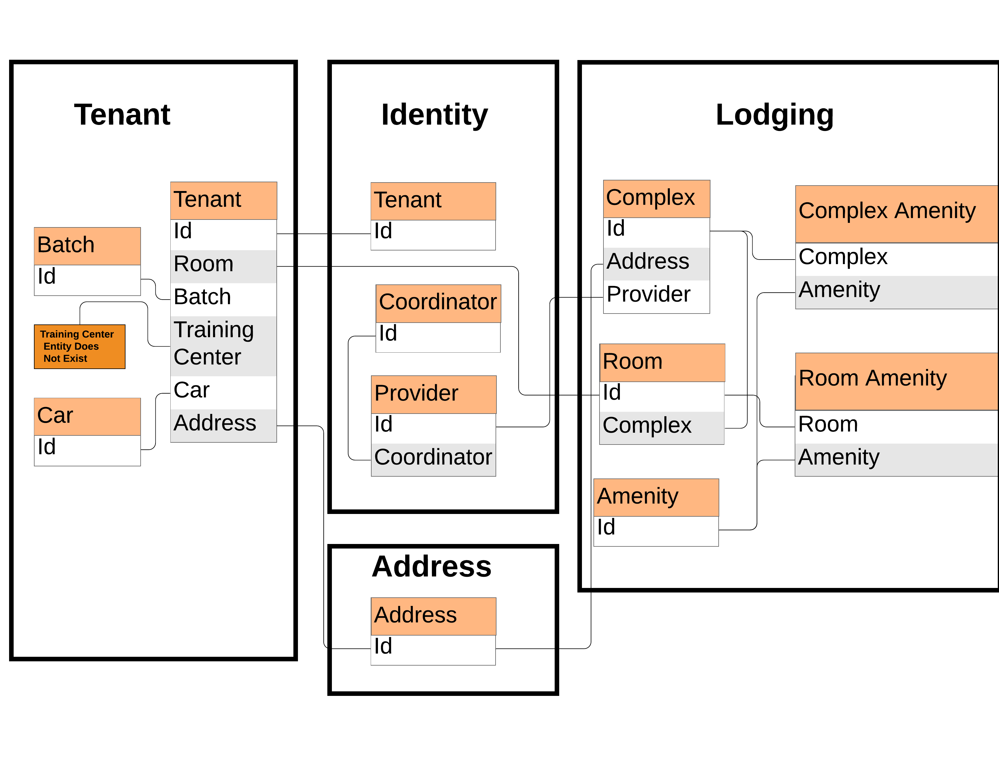

# Overview of Services
## Disclaimer
This and other documents are not a replacement for Swagger, and are more intended for giving an overview of how the services interact with, and depend on, each other. If you want to know how to call a service, please refer to the Swagger documentation for that service. 
## Inter-Service Communication
Services communicate with each other in 2 ways: via HTTP and via a Service Bus
### HTTP
Safe operations (Read) to public endpoints should be done with HTTP requests.
### Service Bus
Non-safe operations (Create, Update, Delete) should be handled via a servie bus. Examples of service bus producers can be found in [Tenant]. Examples of service bus consumers can be found in [Lodging] and [Identity]. \

## Dependencies
Tenant depends on Identity, Address, and Lodging \
Lodging depends on Identity and Address \
Identity and Address depend on nothing \
UI depends on Identity, Lodging, and Tenant
