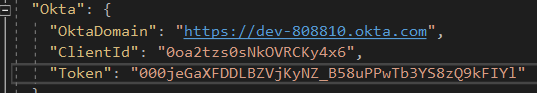

# Setting Everything Up

SonarCloud: https://sonarcloud.io/organizations/revaturexyz/projects?sort=-analysis_date

## AppSettings

Because `appsettings.json` is not gitignored, you will have to copy the contents of it to `appsettings.Development.json`, which is gitignored, before making any changes.

Identity:
```json
{
  "ConnectionStrings": {
    "ServiceBus": "Service-Bus-Connection-String-Here",
    "IdentityDb": "Server=192.168.99.100;Port=8000;Database=IdentityDb;Username=postgres;Password=Pass@word"
  },
  "Okta": {
    "OktaDomain": "Okta-Domain-Here",
    "ClientId": "0oa2tzs0sNkOVRCKy4x6",
    "Token": "Okta-Token-Here"
  }
}
```
Lodging:

Tenant:

Address:

## Docker

We use docker to spin up development databases with the following command:
```
docker run --rm -it -e POSTGRES_PASSWORD=Pass@word -p 8000:5432 postgres:alpine
```
This will spin up a Docker container with the `postgres` image that can be accessed on port 8000 with password `Pass@word`. If you are using Docker Desktop, this will be `localhost:8000`. If you are using Docker Toolbox, this will be at `192.168.99.100:8000`. In order to access it from Visual Studio, you will need to set up the connection string in your `secrets.json` file. The following is an example for the Tenant service with Docker Desktop, on port 8000, with password `Pass@word`. **You will have to change `localhost` to `192.168.99.100` if you are using Docker Toolbox.**

```json
{
  "ConnectionStrings": {
    "TenantDb": "Server=localhost;Port=8000;Database=tenant;Username=postgres;Password=Pass@word"
  },
  "Okta": {
    "OktaDomain": "Okta-Domain-Here"
  }
}
```
As of right now, your programs will not run because your Okta domain "does not start with https".
The following section will fix that.

## Okta

As of right now, this is needed for all services besides the Address service.
To get Okta working from the codebase, an Okta account is needed.
Go to https://developer.okta.com, click on signup, and fill out the required information.
After confirming your email, go to your new account and click on Users -> Groups and click add group, creating "Coordinator". Create the groups "Provider" and "Tenant" as well.
Your groups should look something like this:


Next, go to API -> Authorization Servers and select the default server. (note the URI shown)
Click on Claims, then on Add Claim. Set the name "Roles", Include in token type to "ID token", "Always", Value type "Groups", Filter to matches regex `.*`, and include in any scope. It should look like this:


Then, make another using Access. Your settings should look something like this when done:


Next, go to the applications tab. Click add application. For the front end, select single page app and click next. Change the Base URI to `localhost:4200` and choose a descriptive name. In the Angular app, change `environment.ts` to include:

- `domain: 'https://dev-####.okta.com'`
- `issuer: 'https://dev-####.okta.com/oauth2/default'`,
- `clientID: '<clientid from the app you just created>'`
- `redirectUri: 'https://localhost:4200/implicit/callback'`

App.config should be injected in `app.module.ts`.
Next, make a token. To do this, click on API -> Tokens, then on create token. Name the token whatever you like; e.g. managementToken. *Make sure not to lose the token value.*
In each API, add the following in `appsettings.Development.json`, using your Okta domain, client ID, and token. Only the Identity service needs the token.



## Adding Okta to a new API
Middleware: Add to Startup.cs in ConfigureServices:
```c#
services.AddAuthentication(options =>
{
  options.DefaultAuthenticateScheme = OktaDefaults.ApiAuthenticationScheme;
  options.DefaultSignInScheme = OktaDefaults.ApiAuthenticationScheme;
  options.DefaultChallengeScheme = JwtBearerDefaults.AuthenticationScheme;
})
.AddJwtBearer(options =>
{
  options.Authority = Configuration["Okta:Domain"] + "/oauth2/default";
  options.Audience = "api://default";
  options.RequireHttpsMetadata = true;
  options.SaveToken = true;
  options.TokenValidationParameters = new TokenValidationParameters
  {
    NameClaimType = "name",
    RoleClaimType = "groups",
    ValidateIssuer = true,
  };
});
```

In your controller, add the Authorize filter to add authentication and authorization to the controller  and/or http methods.
E.g.:
```c#
// adds authentication, only authenticated users can access
[Authorize]

// authentication + role-based authorization, can only be accessed by an account that has
//'Coordinator' in its role
[Authorize(Roles="Coordinator")]

// authorization for Coordinator OR Provider
[Authorize(Roles="Coordinator,Provider")]

// authorization for Coordinator AND Provider
[Authorize(Roles="Coordinator")]
[Authorize(Roles="Provider")]
```


These Roles can be managed in the Okta Client which can be found under Users -> Groups

>COORDINATOR \
Name: Test_One \
Email: revtestone2020@gmail.com, rectestone2020+1@gmail.com \
Password: (hidden) \
Birthday: January 1 2000 \
OKTA password: UTAokta2020 \
OKTA What is your favorite security question: None

>PROVIDER - PENDING \
Name: Test_Two \
Email: revtesttwo2020@gmail.com \
Password: (hidden) \
Birthday: January 1 2000 \
OKTA password : UTAokta2020 \
OKTA What is your favorite security question: None

>PROVIDER - APPROVED \
Name: Test_Three \
Email: revtestthree2020@gmail.com, revtestthree2020+1@gmail.com \
Password: (hidden) \
Birthday: January 1 2000 \
OKTA password : UTAokta2020 \
OKTA What is your favorite security question: None

>TENANT \
Name: Test_Four \
Email: revtestfour2020@gmail.com, revtestfour2020+1@gmail.com, revtestfour2020+2@gmail.com \
Password: (hidden) \
Birthday: January 1 2000 \
OKTA password : UTAokta2020 \
OKTA What is your favorite security question: None

## Google APIs
This section is required only for the Address service, which consumes the Google Distance Matrix API and Geocoding API.

https://cloud.google.com/maps-platform/

## Docker Compose

# Overview of Services

## Disclaimer

This section of the document is not a replacement for Swagger, and is more intended for giving an overview of how the services interact with, and depend on, each other. If you want to know how to call a service, please refer to the Swagger documentation for that service.

## Inter-Service Communication

// TODO: Talk about service buses and how they work, the various classes which use HTTPRequest, when you should use each, and that there are good examples in the code.


## Dependencies

- Tenant depends on Identity, Address, and Lodging
- Lodging depends on Identity and Address
- Identity and Address depend on nothing
- UI depends on Identity, Lodging, and Tenant

## Identity

Port: 9100

### Coordinator
#### /api/coordinator-accounts/id
* Resource: Account GUID for signed in account
* GET: Roles: All
  * Updates Okta with roles from local DB, also updates local DB for coordinators
  * Consumed by the landing page of the frontend SPA
#### /api/coordinator-accounts/{id}
* Resource: Coordinator Account
* Get: Roles: Coordinator
  * Used to get the current coordinator account when logged in as coordinator
  * Consumed in SPA
#### /api/coordinator-accounts/all
* Resource: all existing coordinators
* GET: Roles: Coordinator
  * Currently not consumed

### Provider
#### /api/provider-accounts/{id}
* Resource: Provider
* GET: Roles: Any
  * Used to get a provider by id
  * Consumed in SPA
* PUT(CoordinatorId, Name, Email): Roles: coordinator
  * Used to change the name, email, or coordinator in charge of a provider
  * Consumed in SPA
* DELETE: Roles: Coordinator
  * Used to delete a provider account
  * Consumed in SPA
#### /api/provider-accounts/{id}/approve
* Resource: Provider
* PUT: Roles: Coordinator
  * Used to change the status of a provider to Approved
  * Okta will be updated with this change on the next login by the provider
  * Consumed in SPA

### Tenant
#### /api/tenant-accounts/{id}
* Resource: Tenant
* GET: Roles: Tenant, Coordinator, Tenant
  * Return the details of a tenant by ID
  * Consumed in SPA

### Notification
Currently not implemented

## Tenant

Port: 9140

### Tenant
#### /api/tenant
* Resource: collection of tenants (See Swagger for possible filters)
* GET: Roles: Coordinator
  * Shouldn't consume any services
  * Consumed in SPA service tenant-searcher
#### /api/tenant/batch
* Resource: collection of batches potentially filtered by training location
* GET: Roles: Coordinator
  * Doesn't consume
  * Isn't consumed
#### /api/tenant/register
* Resource: Tenant
* POST: Roles: Coordinator
  * Registers a tenant
  * Consumed Address (/api/address/)
  * Consumed by Identity via Service Bus
  * Consumed by SPA service tenant
#### /api/tenant/{id}
* Resource: Tenant
* GET: Roles: Coordinator, Tenant (with matching id)
  * Returns a tenant and associated objects based on id
  * Should consume address (/api/address/{id})
  * Consumed in SPA service tenant
#### /api/tenant/update
* Resource: Tenant
* PUT: Roles: Coordinator (Tenant should be able to put in update request for self, but that might be a different endpoint)
  * Updates Existing tenant
  * Consumes Address
  * Consumed by SPA service tenant
  * Consumed by Identity via Service Bus TenantCUD
#### /api/tenant/delete/{id}
* Resource: Tenant
* DELETE: Roles: Coordinator
  * Deletes existing tenant
  * Consumed by Identity via Service Bus TenantCUD
  * Consumed by SPA service tenant-searcher

### TenantRoom
#### /api/tenant/unassigned
* Resource: all tenants not assigned to a room
* GET: Roles: Coordinator
  * Shouldn't consume anything
  * Consumed by SPA service tenant-assign
#### /api/tenant/assign/{tenantid}
* Resource: Tenant
* PUT: Roles: Coordinator
  * Updates tenant room id
  * Consumes Lodging via service bus queue AssignedRoom
#### /api/tenant/assign/availablerooms
* Resource: collection of rooms (See Swagger for allowed filters)
* GET: Roles: Coordinator
  * Consumes Lodging (/api/rooms) (may not be implemented)

## Lodging

Port: 9120

### Complex
#### /api/complex
* Resource: all existing complexes
* GET: Roles: (#######)
#### /api/complex/providerid/{providerid}
* Resource: all existing complexes owned by the given provider
* Get: Roles: (#######)
#### /api/complex/{complexid}
* Resource: Existing complex with the given ID
* GET: Roles: (########)
#### /api/complex
* Resource: Complex
* POST: Roles: Provider
  * Adds a complex to the database
  * Return the added complex if successful
#### /api/complex
* Resource: Complex
* PUT: Roles: Provider
  * Edits a complex and replaces the associated complex amenities with the passed list of amenities
#### /api/complex/{complexid}
* Resource: Complex
* DELETE: Roles: Provider
  * Deletes a Complex and its amenities from the database based on complex ID

### Room
#### /api/room/complexId/{complexId}
* Resource: collection of rooms in a given complex, filterable
* GET: Roles: (#####)
  * filtering with query string
#### api/room
* Resource: Room
* POST: Roles: (######)
#### api/room/{roomid}
* Resource: Room
* GET: Roles: (######)
* PUT: Roles: (######)
* DELETE: Roles: (######)

## Address

Port: 9110

**Note: This service looks wrong. It looks like there is a get which is posting. However, this service is acting as an immutable normalized address cache, and its 3 get methods work as intended.**

### Address
#### /api/address
* Resource: Normalized address corresponding to given address parameters
* GET(query string)
  * Gets a normalized address and an id for that address
  * Consumed by post and put methods in tenant and lodging service
#### /api/address/{id}
* Resource: Normalized Address
* GET
  * Gets a normalized address by id
  * Consumed by Tenant and Lodging services
#### /api/address/checkdistance
* Resource: Whether or not two addresses are within 20 miles of each other
* GET
  * Should be consumed by lodging, but as training center is not implemented, there is nothing to compare a complex address with

# Overview of UI

## Overview
The Angular portion of the Revature Housing project is focused on consuming the various APIs in order to display and edit complex and room information, as well as add and display Tenant data.

On Login:
* Tenant - Can view their profile information, view room information, as well as make maintenance requests. Currently the only functionality inside the code, is the Tenants ability to  view their current room information.
* Coordinator - Has the ability to add tenants, search for tenants, view complex information. View information relating to tenants
* Provider - Has the ability to manage complexes, which consists of observing current complexes that they manage. The ability to view the rooms within the complex that they manage.

## Components
### search-tenant
User story: As a user I should be able to display a list of all tenants, as well as be able to filter them according to different attributes belonging to tenant.

### select-tenant
User story: As a user with admin privileges, I should be able to delete tenants from the database.

- `deleteTrigger()` - confirms the deletion of tenant
- `deleteStop()` - denies the deletion of tenant
- `deleteGo()` - executes the deletion of a tenant
- `routeToSearchTenant()` - navigate to the search tenant web page

### Tenant-maintenance
User Story: As a user, I should be able to raise maintenance issues to the complex I’m staying at. I should have the ability to designate different issues for different areas of the living unit.

The models are as follows:
```ts
areas: Array<string>;     	//list of areas in
area_entrance: Array<string>; //entrance/halls
area_living: Array<string>;   //living/dining room
area_kitchen: Array<string>;  //kitchen
area_bed: Array<string>;  	//bedroom
area_bath: Array<string>; 	//bathroom
area_other: Array<string>;	//other equipment

maintenanceFG = new FormGroup({
unitFC: new FormControl(''),
roomFC: new FormControl(''),
firstnameFC: new FormControl(''),
lastnameFC: new FormControl(''),
emailFC: new FormControl(''),
areaFC: new FormControl(''),
descriptionFC: new FormControl('')
});

this.areas =
[
  'Entrance/Halls',
  'Living/Dining Room',
  'Kitchen',
  'Bedroom(s)',
  'Bathroom(s)',
  'Other'
];
```

Majority of this component is currently using two-way binding. There does not yet exist a database object to hold maintenance request.

### View-Room
User Story:
Allows for Tenants, and those who have tenant roles. To see their information, based on their tenant id which is a GUID. Accesses the GUID from Identity API. Then with the GUID tenant id they would access the Tenant Api to get the Room ID which is a GUID. Then uses the Lodging service to to get the room details, with the getRoomById(Room ID).

As of the hand off of the Jan 06 batch, it uses this model to store data:

```ts
room: Room = {
	roomId: null,
	roomNumber: '',
	numberOfBeds: null,
	numberOfOccupants: null,
	apiRoomType: null,
	Amenities: null,
	leaseStart: null,
	leaseEnd: null,
	complexId: null,
	Gender: null
}
```

Of these, the information displayed in the view-room component include roomNumber, numberOfBeds, numberOfOccupants, Amenities, leaseStart + leaseEnd.

`sessionStorage.getItem('guid')`
This line is responsible for passing in the Okta guid from session storage. It is the reason our auth can communicate with DB objects.

The two methods called on initialization are:

- `this.getTenantInfo(this.tenantid);` This is meant to populate the current tenant as a result of Okta auth
- `this.getTenantRoom(this.currentTenant.roomId);` This is meant to populate the Room mapped to the tenant as a result of current tenant.

`tenantId` - string object that is meant to obtain the GUID generated by okta as a string. Should contain the correct value upon runtime in local, cookie, or session storage.

`currentTenant` - Tenant object containing all the information of the currently logged in tenant. It’s ultimate purpose is to transfer its room information to currentRoom.

`currentRoom` - Room object containing all of the information that is to be displayed in the component.

`getById()` method: obsolete upon the inclusion of tenant room. The only reason it’s still in the code at all is because of the limitations imposed to us regarding commits and pull requests.

For this same reason, there still exists objects holding mock data within the component. The following objects can be removed without affecting the correctness of the program:
- XRoom
- X,Y,Z Amenity
- AList
- Yeet
- Stat
- Prov
- Comp
- Gen

Services Used:
- Identity Service - Used to access information about current tenant , to return the tenant id
- Tenant Service - Used to access tenant information with method getTenantById, giving access to the room ID
- Lodging Service - Used to access room information with the method getRoomById.

### Tenant-profile
User story: A user should be able to view their personal information that is associated with their account. This information is held in a tenant object, which itself consists of several other objects such as tenant address, car, batch, training center.

- `getTenantInfo` - is meant to populate the current tenant as a result of Okta auth.
- `getTenantRoom` - is meant to populate the Room mapped to the tenant as a result of current tenant.

In the tenant-profile component we display firstname, lastname, gender, email, all address info, all batch info, and all car info.

## Services

### Lodging Service [Complex Methods]
- GetAllComplexes(), consumes api/complex GET
- GetComplexById(ComplexId : string (GUID)), consumes api/complex/{complexid} GET
GetComplexesByProviderId(ProviderId: string (GUID)), consumes api/complex/providerId/- {providerId} GET
- AddComplex(newComplex: <PostComplex>), consumes api/complex POST
- UpdateComplex(updatedComplex: <Complex>), consumes api/complex PUT
- DeleteComplexById(ComplexId : string (GUID)), consumes api/complex/{complexId} DELETE

### Lodging Service [Room Methods]
- `GetFilteredRooms(complexId: string, query: string)`, consumes api/room/complexid/{complexId} GET, with GUID and query string:
  ```c#
  [FromQuery] string roomNumber,
  [FromQuery] int? numberOfBeds,
  [FromQuery] string roomType,
  [FromQuery] string gender,
  [FromQuery] DateTime? endDate,
  [FromQuery] Guid? roomId,
  [FromQuery] bool? vacancy,
  [FromQuery] bool? empty)
  ```
- `AddRoom(newRoom: postRoom)`, consumes api/Room POST
- `UpdateRoom(roomId: string, room: Room)`, with GUID, consumes api/room/{roomid} PUT
- `DeleteRoom(roomId: string`, with GUID, consumes api/room/{roomid} DELETE

### Identity Service
### Tenant Service
### View-room Service
