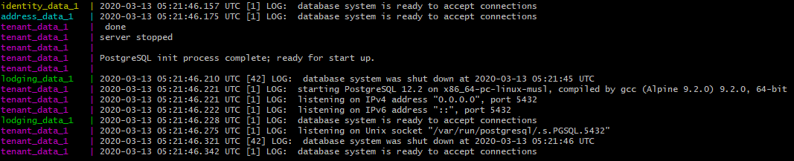
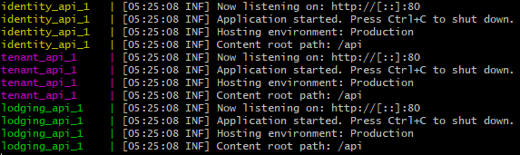

# Getting Started
## Cloning the Repo
## Setting up Consumed Services
### Okta
As of right now, this is needed for all services besides the Address service.
To get okta working from the codebase, an okta account is needed. 
Go to https://developer.okta.com/, click on signup, and fill out the required information.
After confirming your email, go to your new account and click on Users->Groups and click add group, creating “Coordinator”. Create the groups “Provider” and “Tenant” as well. 
Your groups should look something like this: \
 \
Next, go to API ->Authorization Servers and select the default server. (note the URI shown)
Click on Claims, then on Add Claim. Set the name “Roles”, Include in token type to “ID token”, “Always”, Value type “Groups”, Filter to matches regex .\*, and include in any scope. It should look like this: \
 \
Then, make another using Access. Your settings should look something like this when done: \
 \
Next, go to the applications tab. Click add application. For the front end, select single page app and click next. Change the Base URI to localhost:4200 and choose a descriptive name. In the angular app, change environment.ts to include domain: `https://dev-####.okta.com`, issuer: `https://dev-####.okta.com/oauth2/default`, clientID: <clientid from the app you just created>, redirectUri: `https://localhost:4200/implicit/callback`. App.config should be injected in app.module.ts.
Next, make a token. To do this, click on API -> Tokens, then on create token. Name the token whatever you like, we used managementToken. *Make sure not to lose the token value.*
In each API, add the following in appsettings.development.json, using your okta domain, client ID, and token. Only the Identity service needs the token.\

#### User accounts in seed data
There are a number of accounts in the seed data in identity, but you will have to create new Okta accounts for them. Your trainer will have the email passwords for these accounts. Also note that some of these emails are `revtest{one-four}+{number}@gmail.com`. Okta treats emails with +{tag} in them as different emails; however, all accounts with the same one-four number are accessed through the same email account.

```
COORDINATOR 
Name: Test_One 
Email: revtestone2020@gmail.com, revtestone2020+1@gmail.com 
Password: hidden 
Birthday: January 1 2000 
OKTA password: UTAokta2020 
OKTA What is your favorite security question: None 

PROVIDER - PENDING 
Name: Test_Two 
Email: revtesttwo2020@gmail.com 
Password: hidden 
Birthday: January 1 2000 
OKTA password : UTAokta2020 
OKTA What is your favorite security question: None 

PROVIDER - APPROVED 
Name: Test_Three 
Email: revtestthree2020@gmail.com, revtestthree2020+1@gmail.com 
Password: hidden 
Birthday: January 1 2000 
OKTA password : UTAokta2020 
OKTA What is your favorite security question: None 

TENANT 
Name: Test_Four 
Email: revtestfour2020@gmail.com, revtestfour2020+1@gmail.com, revtestfour2020+2@gmail.com 
Password: hidden 
Birthday: January 1 2000 
OKTA password : UTAokta2020 
OKTA What is your favorite security question: None 
```
### Google APIs
#### This section might look filled in, but it does need work
This section is required only for the Address service, which consumes the google maps Distance Matrix API and Geocoding API. \
https://cloud.google.com/maps-platform/
1. From the above link, click “Get Started”.
2. You will be prompted to create a new project. Enter a name for your project.

3. Agree to the Terms of Service pictured above, and click Create.
4. You will be prompted to enable billing. Click Create Billing Account.

5. Step through the process to set up your billing.
6. You will be prompted to pick your products. Check the boxes next to the Routes and Places APIs to enable them. These will give you access to the Distance Matrix and Geocoding API as required above.

7. Click Next. In the next window, fill out your industry and what you want to build as prompted.
8. Your API key will be generated for you! Store it somewhere safe and click Done.

## Running with Visual Studio
### Configuration
#### This section might look filled in, but it does need work
Because appsettings.json is not gitignored, you will have to copy the contents of it to appsettings.development.json, which is gitignored, before making any changes. \
The following uses identity as an example of what you would put in appsettings.
Identity: 
``` 
{ 
  "ConnectionStrings": {
    `ServiceBus": "(Enter Service Bus Connection String)",
    "IdentityDb": "Server=localhost;Port=8000;Database=identity;Username=postgres;Password=Pass@word""
  },
  "Okta": { 
    "OktaDomain": "https://dev-808810.okta.com", 
    "ClientId": "0oa2tzs0sNkOVRCKy4x6", 
    "Token": "000jeGaXFDDLBZVjKyNZ_B58uPPwTb3YS8zQ9kFIYl" 
  } 
}
```

### Running the database container
We use docker to spin up development databases with the following command: \
`docker run --rm -it -e POSTGRES_PASSWORD=Pass@word -p 8000:5432 postgres:alpine` \
This will spin up a docker container with the postgres image that can be accessed on `port 8000` with password `Pass@word`. If you are using Docker Desktop, this will be `localhost:8000`. If you are using Docker Toolbox, this will be at `192.168.99.100:8000`. In order to access it from Visual Studio, you will need to set up the connection string in your secrets.json file. The following is an example for the Tenant service with Docker Desktop, on `port 8000`, with password `Pass@word`. You will have to change localhost to `192.168.99.100` if you are using docker toolbox. 
```
{ 
  "ConnectionStrings": { 
    "TenantDb": "Server=localhost;Port=8000;Database=tenant;Username=postgres;Password=Pass@word" 
  }, 
  "Okta": {  
      "OktaDomain": “Okta-Domain-Here” 
  } 
} 
```

### Running the code
## Running with Docker Compose
### Configuration
#### This section might look filled in, but it does need work
Whoever does the configuration for VS, do this section too.
Basically, you need to fill data in these 5 files to match what is in appsettings, and you need to copy \*.template to the same name but without the .template extension. Ideally, there should be a script that splits config from a single file into the five files needed by docker compose.
`A__B=setting` (note there are no quotes) in these files is the same setting as `A: { B: "setting"}`
The five files that hold the configuration follow. Note that you don't need to set up database connection strings because that is handled by docker compose.
- .[addressAPIKey].template => .addressAPIKey
- .[commonConfig]
- .[commonSecret].template => .commonSecret
- .[identitySecret].template => .identitySecret
- .[oktaSecrets].template => .oktaSecrets
### Commands
`docker-compose -f manifest.docker.yaml up identity_data address_data lodging_data tenant_data`
You need to run the data containers first and wait for them to be in a state to accept connections.
 \
`docker-compose -f manifest.docker.yaml build identity_api address_api lodging_api tenant_api`
If you have made changes to your application, you will need to run the build command to ensure you are using the latest version. This step can be run in parallel with the previous step without any issues.
`docker-compose -f manifest.docker.yaml up identity_api address_api lodging_api tenant_api`
After the data containers are ready, and the api has built (if needed), you are ready to run your services in docker containers. After this step, if everything went well, you should be able to access the services at the local address noted in each service.
 \
`docker-compose -f manifest.docker.yaml down`
By default, after stopping the containers, data persists. If you want to return to seed data, you need to run the down command.

# Working with existing architecture
## Adding Okta to a new API
Middleware: Add to Startup.cs in ConfigureServices: 
```
services.AddAuthentication(options => 
{ 
  	options.DefaultAuthenticateScheme = OktaDefaults.ApiAuthenticationScheme; 
   	options.DefaultSignInScheme = OktaDefaults.ApiAuthenticationScheme; 
   	options.DefaultChallengeScheme = JwtBearerDefaults.AuthenticationScheme; 
}) 
.AddJwtBearer(options => 
{ 
  options.Authority = Configuration["Okta:Domain"] + "/oauth2/default"; 
  options.Audience = "api://default"; 
  options.RequireHttpsMetadata = true; 
  options.SaveToken = true; 
  options.TokenValidationParameters = new TokenValidationParameters 
  { 
    NameClaimType = "name", 
    RoleClaimType = "groups", 
    ValidateIssuer = true, 
  }; 
});
```
In your controller, add the Authorize filter to add authentication and authorization to the controller  and/or http methods. \
E.g. 
``` C#
// adds authentication, only authenticated users can access 
[Authorize] 

// authentication + role-based authorization, can only be accessed by an account that has 
//‘Coordinator’ in their role 
[Authorize(Roles=”Coordinator”)] 

// authorization for Coordinator OR Provider 
[Authorize(Roles=”Coordinator,Provider”)] 

// authorization for Coordinator AND Provider 
[Authorize(Roles=”Coordinator”)]
[Authorize(Roles=”Provider”)]
``` 


## Pipeline
Talk about Azure Pipelines for a bit
### When it runs
The pipeline runs on every pull request into master as well as commits on master. The pipeline only runs the build stage on PRs and all of the build, pack, and deploy stages on commits.
### Reasons for failed pipelines
The pipeline will fail on failed tests, so make sure your tests pass before you push.
### Artifacts
A successful build on a pull request into master will deploy the services on Azure App Service, the root endpoints are listed in the individual services.

In addition to deploying the services, it provides static analysis on SonarCloud which is visible here.
Sonarcloud: https://sonarcloud.io/organizations/revaturexyz/projects?sort=-analysis_date

# Overview of Services
## Disclaimer
This section of the document is not a replacement for Swagger, and is more intended for giving an overview of how the services interact with, and depend on, each other. If you want to know how to call a service, please refer to the Swagger documentation for that service. 
## Inter-Service Communication
// TODO: Talk about service buses and how they work, the various classes which use HTTPRequest, when you should use each, and that there are good examples in the code. \

## Dependencies
Tenant depends on Identity, Address, and Lodging \
Lodging depends on Identity and Address \
Identity and Address depend on nothing \
UI depends on Identity, Lodging, and Tenant 

## Identity
Port: 9100
### Coordinator
#### /api/coordinator-accounts/id
* Resource: Account Guid for signed in account
* GET: Roles: All
  * Updates okta with roles from local db, also updates local db for coordinators
  * Consumed by the landing page of the front end SPA
#### /api/coordinator-accounts/{id}
* Resource: Coordinator Account
* Get: Roles: Coordinator
  * Used to get the current coordinator account when logged in as coordinator
  * Consumed in SPA
#### /api/coordinator-accounts/all
* Resource: List<Coordinator>
* Get: Roles: Coordinator
  * Used to get a list of all existing coordinators
  * Currently not consumed

### Provider
#### /api/provider-accounts/{id}
* Resource: Provider
* Get: Roles: Any
  * Used to get a provider by id
  * Consumed in SPA
#### /api/provider-accounts/{id}
* Resource: Provider
* Put("CoordinatorId, Name, Email"): Roles: coordinator
  * Used to change the name, email, or coordinator in charge of a provider
  * Consumed in SPA
#### /api/provider-accounts/{id}/approve
* Resource: Provider
* Put(id): Roles: Coordinator
  * Used to change the status of a provider to Approved
  * Okta will be updated with this change on the next login by the provider
  * Consumed in SPA
#### /api/provider-accounts/{id}
* Resource: Provider
* Delete(id): Roles: Coordinator
  * Used to delete a provider account
  * Consumed in SPA
### Tenant
#### /api/tenant-accounts/{id}
* Resource: Tenant
* Get(id) Roles: Tenant, Coordinator, Tenant
  * Return the details of a tenant by id
  * Consumed in SPA
### Notification
Currently not implemented
## Tenant
Port: 9140
### Tenant
#### /api/tenant/
* Resource: Tenant
* GET: Roles: Coordinator
  * Returns a filtered list of tenants (See Swagger for possible filters)
  * Shouldn't consume any servies
  * Consumed in SPA service tenant-searcher
#### /api/tenant/{id}
* Resource: Tenant
* GET: Roles: Coordinator, Tenant (with matching id)
  * Returns a tenant and associated objects based on id
  * Should consume address (/api/address/{id})
  * Consumed in SPA service tenant
#### /api/tenant/batch
* Resource: Batch
* Get: Roles: Coordinator
  * Returns a list of batches potentially filtered by training location
  * Doesn't consume
  * Isn't consumed
#### /api/tenant/register
* Resource: Tenant
* Post: Roles: Coordinator
  * Registers a tenant
  * Consumed Address (/api/address/)
  * Consumed by Identity via service bus
  * Consumed by SPA service tenant
#### /api/tenant/update
* Resource: Tenant
* Put: Roles: Coordinator (Tenant should be able to put in update request for self, but that might be a different endpoint)
  * Updates Existing tenant
  * Consumes Address
  * Consumed by SPA service tenant
  * Consumed by Identity via service bus TenantCRUD
#### /api/tenant/delete/{id}
* Resource: Tenant
* Delete: Roles: Coordinator
  * Deletes existing tenant
  * Consumed by Identity via service bus TenantCRUD
  * Consumed by SPA service tenant-searcher
### TenantRoom
#### /api/tenant/unassigned
* Resource: Tenant
* Get: Roles: Coordinator
  * Returns a list of tenants not assigned to a room
  * Shouldn't consume anything
  * Consumed by SPA service tenant-assign
#### /api/tenant/assign/availablerooms
* Resource: Room
* Get: Roles: Coordinator
  * Returns a filtered list of rooms (See Swagger for allowed filters)
  * Consumes Lodging (/api/rooms) (may not be implemented)
#### /api/tenant/assign/{tenantid}
* Resource: Tenant
* Put: Roles: Coordinator
  * Updates tenant room id
  * Consumes Lodging via service bus queue AssignedRoom
## Lodging
Port: 9120
### Complex
#### /api/complex
* Resource: Complex
* Get: Roles: (#######)
  * Gets all existing complexes from the database
#### /api/complex/{complexid}
* Resource: Complex
* Get: Roles: (########)
  * Gets an existing complex from the database based on complex id
#### /api/complex/providerid/{providerid}
* Resource: Complex
* Get: Roles: (#######)
  * Gets all existing complexes with the given providerid
#### /api/complex
* Resource: Complex
* Post: Roles: Provider
  * Adds a complex to the database
  * Return the added complex if successful
#### /api/complex
* Resource: Complex
* Put: Roles: Provider
  * Edits a complex and replaces the associated complex amenities with the passed list of amenities
#### /api/complex/{complexid}
* Resource: Complex
* Delete: Roles: Provider
  * Deletes a Complex and its amenities from the database based on complexid
### Room
#### /api/room/complexId/{complexId}
* Resource: Room
* Get: Roles: (#####)
  * Gets rooms that match a query string
#### api/room/{roomid}
* Resource: Room
* Get: Roles: (######)
  * Gets a room by room id
#### api/room
* Resource: Room
* Post(ApiRoom): Roles: (######)
  * Adds a new room the the database
#### api/room/{roomId}
* Resource: Room
* Put(roomId, APiRoom): Roles: (######)
  * Edits an existing room with the given room id, to the given room object
#### api/room/{roomId}
* Resource: Room
* Delete: Roles: (######)
  * Deletes the room with the given id
## Address
Port: 9110
**Note: This service looks wrong. It looks like there is a get which is posting. However, this service is acting as an immutable normalized address cache, and its 3 get methods work as intended.**
### Address
#### /api/address/{id}
* Resource: Normalized Address
* Get
  * Gets a normalized address by id
  * Consumed by Tenant and Lodging services
#### /api/address/checkdistance
* Resource: Boolean whether two addresses are within 20 miles of each other
* Get
  * Gets whether an address is within 20 miles of another address
  * Should be consumed by lodging, but as training center is not implemented, there is nothing to compare a complex address with
#### /api/address
* Resource: Normalized Address and Id
* Get
  * Gets a normalized address and an id for that address
  * Consumed by post and put methods in tenant and lodging service
# Overview of UI
## Overview
The Angular portion of the Revature Housing project is focused on consuming the various APIs in order to display and edit complex and room information, as well as add and display Tenant data. 
* On Login: 
  * Tenant - Can view their profile information, view room information, as well as make maintenance requests. Currently the only functionality inside the code, is the Tenants ability to  view their current room information. 
  * Coordinator - Has the ability to add tenants, search for tenants, view complex information. View information relating to tenants 
  * Provider - Has the ability to manage complexes, which consists of observing current complexes that they manage. The ability to view the rooms within the complex that they manage.  
## Components
### search-tenant
User story: As a user I should be able to display a list of all tenants, as well as be able to filter them according to different attributes belonging to tenant. 
### select-tenant
User story: As a user with admin privileges, I should be able to delete tenants from the database. \
`deleteTrigger()` - confirms the deletion of tenant \
`deleteStop()` - denies the deletion of tenant \
`deleteGo()` - executes the deletion of a tenant \
routeToSearchTenant() - navigate to the search tenant web page 
### Tenant-maintenance
User Story: As a user, I should be able to raise maintenance issues to the complex I’m staying at. I should have the ability to designate different issues for different areas of the living unit. \
The models are as follows: 
``` C#
  areas: Array<string>;     	//list of areas in 
  area_entrance: Array<string>; //entrance/halls 
  area_living: Array<string>;   //living/dining room 
  area_kitchen: Array<string>;  //kitchen 
  area_bed: Array<string>;  	//bedroom 
  area_bath: Array<string>; 	//bathroom 
  area_other: Array<string>;	//other equipment 
 
  maintenanceFG = new FormGroup({ 
	unitFC: new FormControl(''), 
	roomFC: new FormControl(''), 
	firstnameFC: new FormControl(''), 
	lastnameFC: new FormControl(''), 
	emailFC: new FormControl(''), 
	areaFC: new FormControl(''), 
	descriptionFC: new FormControl('') 
  }); 

  this.areas = 
	[ 
  	'Entrance/Halls', 
  	'Living/Dining Room', 
  	'Kitchen', 
  	'Bedroom(s)', 
  	'Bathroom(s)', 
  	'Other' 
	]; 
```
Majority of this component is currently double binding to html. There does not yet exist a database object to hold maintenance request. 
### View-Room
User Story: \
Allows for Tenants, and those who have tenant roles. To see their information, based on their tenant id which is a GUID. Accesses the GUID from Identity API. Then with the GUID tenant id they would access the Tenant Api to get the Room ID which is a GUID. Then uses the Lodging service to to get the room details, with the getRoomById(Room ID). \
As of the hand off of the Jan 06 batch, it uses this model to store data: 
``` C#
room: Room = { 
	roomId: null, 
	roomNumber: ‘’, 
	numberOfBeds: null, 
	numberOfOccupants: null, 
	apiRoomType: null, 
	Amenities: null, 
	leaseStart: null, 
	leaseEnd: null, 
	complexId: null, 
	Gender: null 
}
```
Of these, the information displayed in view-room .html include roomNumber, numberOfBeds, numberOfOccupants, Amenities, leaseStart + leaseEnd. 

sessionStorage.getItem('guid') \
This line is responsible for passing in the Okta guid from session storage. It is the reason our auth can communicate with DB objects. 

The two methods called on initialization are: \
this.getTenantInfo(this.tenantid); \
this.getTenantRoom(this.currentTenant.roomId); 

getTenant info is meant to populate the current tenant as a result of Okta auth. \
getTenantRoom is meant to populate the Room mapped to the tenant as a result of current tenant. 

tenantid - string object that is meant to obtain the guid generated by okta as a string. Should contain the correct value upon runtime in local, cookie, or session storage. 

currentTenant - Tenant object containing all the information of the currently logged in tenant. It’s ultimate purpose is to transfer its room information to currentRoom. 

currentRoom - Room object containing all of the information that is to be displayed in the html view. 

`getById()` method is obsolete upon the inclusion of tenant room. The only reason it’s still in the code at all is because of the limitations imposed to us regarding commits and pull requests. 

For this same reason, there still exists objects holding mock data within the component. The following objects can be removed without affecting the correctness of the program:  
* XRoom
* X,Y,Z Amenity
* AList
* Yeet
* Stat
* Prov
* Comp
* Gen

Services Used: \
Identity Service - Used to access information about current tenant , to return the tenant id \
Tenant Service - Used to access tenant information with method getTenantById , giving access to the room ID \
Lodging Service - Used to access room information with the method getRoomById. 

### Tenant-profile
User story: A user should be able to view their personal information that is associated with their account. This information is held in a tenant object, which itself consists of several other objects such as tenant address, car, batch, training center. 

getTenantInfo - is meant to populate the current tenant as a result of Okta auth. \
getTenantRoom - is meant to populate the Room mapped to the tenant as a result of current tenant. 

In the tenant-profile HTML we display firstname, lastname, gender, email, all address info, all batch info, all car info.  
## Services
### Lodging Service [Complex Methods]
``` C#
GetAllComplexes(), // consumes api/complex GET 
GetComplexById(ComplexId : string (GUID)), // consumes api/complex/{complexid} GET 
GetComplexesByProviderId(ProviderId: string (GUID)),  // consumes api/complex/providerId/{providerId} GET 
AddComplex(newComplex: <PostComplex>),  // consumes api/complex POST 
UpdateComplex(updatedComplex: <Complex>), //consumes api/complex PUT 
DeleteComplexById(ComplexId : string (GUID)), // consumes api/complex/{complexId} DELETE 
```

### Lodging Service [Room Methods]
``` C#
GetFilteredRooms(ComplexId : string (GUID) , [FromQuery] string roomNumber, 
[FromQuery] int? numberOfBeds, 
[FromQuery] string roomType, 
[FromQuery] string gender, 
[FromQuery] DateTime? endDate, 
[FromQuery] Guid? roomId,
[FromQuery] bool? vacancy,
[FromQuery] bool? empty),  // consumes api/room/complexid/{ComplexId}? GET 
AddRoom(newRoom: postRoom),  // consumes api/Room POST 
UpdateRoom(roomId : string (GUID), room : Room), // consumes api/room/{roomid} PUT 
DeleteRoom(roomId : string (GUID)), // consumes api/room/{roomid} DELETE
```
### Identity Service
### Tenant Service
### View-room Service

[addressAPIKey]: ../.addressAPIKey.template
[commonConfig]: ../.commonConfig
[commonSecret]: ../.commonSecret.template
[identitySecret]: ../.identitySecret.template
[oktaSecrets]: ../.oktaSecrets.template
